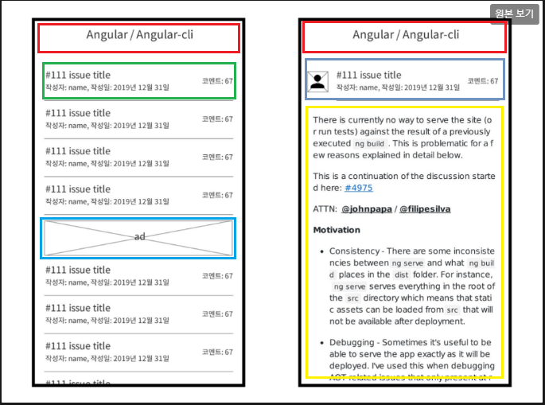

# 1차 회의록

 2023.07.11

## 🥅 목 표

특정 깃헙 레파지토리의[react](https://github.com/facebook/react/issues) 이슈 목록과 상세 내용을 확인하는 웹 사이트 구축

## 🥅 과 제 범 위
테스트 시 access tokens을 사용을 하고 제출 시 access tokens 없이 제출

## 💥개 발 조 건 및 환경

- 언어 : javascript / Typescript
- 필수 기술: React, Context API
- 선택 기술: 
  - Redux와 같은 전역 상태 관리 기술(toolkit 사용 가능, RTK-Query는 사용제한)
  - 스타일 관련 라이브러리(styled-components, emotion, ui kit 등)
  - 라우팅 관련 라이브러리(react-router-dom)
  - HTTP Client(axios 등)
  - 마크다운 렌더링 라이브러리

### ⏺️ 개 발 환 경 회 의 기 록

- **빌드** : `CRA`
- **언어** : `Typescript`
- **스타일링** : `styled-components`
- **상태관리 라이브러리** : `사용 안함` / Context API로만 하는 걸로 결정
- **HTTP Client** : `axios`
- **마크다운 렌더링 라이브러리** : `react-markdown`
- **API** : `GitHub REST API`
- **무한스크롤** : ????

### ⏺️ 커밋 메세지

- Style -> Format으로 변경
- Code, Create 삭제

| | |
|:---:|---|
|Init |	프로젝트 초기 생성|
|Feat |	새로운 기능 추가, 파일 생성, 코드 추가|
|Design |	CSS 등 사용자 UI 디자인 변경|
|Format |	코드 포맷팅, 세미콜론 누락, 코드 변경이 없는 경우|
|Comment |	필요한 주석 추가 및 변경|
|Docs |	문서 수정|
|Fix |	버그 수정|
|Chore |	위에 걸리지 않는 기타 변경사항 (빌드 스크립트 수정, assets image, 패키지 매니저 등)|
|Rename |	파일 혹은 폴더명 수정하거나 옮기는 경우|
|Remove |	파일을 삭제하는 작업만 수행하는 경우|
|Refactor |	코드 리펙토링|

## 💥 기 능 구 현

- 이슈 목록 화면
  - 각 행 `이슈번호`, `이슈제목`, `작성자`, `작성일` `코멘트수` 표시   
  - 상태 `open`인 이슈 중 코멘트가 많은 순으로 정렬   
  - 인피티티 스크롤
  - 5번째 셀마다 광고 이미지 출력   
- 이슈 상세 화면
  - `이슈번호`, `이슈제목`, `작성자`, `작성일` `코멘트수`, `작성자 프로필 이미지`, `본문` 표시
- 공통 헤더
  - `이슈 목록 화면`과 `이슈 상세 화면`은 헤더를 공유합니다.
  - 헤더는 `Organization Name / Repository Name`가 표시됩니다.
- 컴포넌트
   
  

## 💥 요 구 사 항

- 필수 요구 사항
  - 과제 범위 기능 구현
  - Context API를 활용한 API 연동
  - 데이터 요청 중 로딩 표시
  - 에러 화면 구현
- 선택 사항
  - css in js

## 💥 Github API

- 개인용 엑세스 토큰 받는법 [(링크)](https://docs.github.com/en/authentication/keeping-your-account-and-data-secure/managing-your-personal-access-tokens)
- Git Issues REST API [(링크)](https://docs.github.com/en/rest/issues/issues?apiVersion=2022-11-28#list-repository-issues)
  - 경로(baseurl) : `https://api.github.com`
    - ex ) `https://api.github.com/repos/{owner}/{repo}/issues`(전체)
    - ex ) `https://api.github.com/repos/{owner}/{repo}/issues?page=2&per_page=10`(일부)
    - ex )  `https://api.github.com/repos/{owner}/{repo}/issues/1`(상세)
  - 경로 파라메터(Path parameters)
    - `{owner}` : 레포지토리 오너
    - `{repo}` : 레포지토리 이름
  - 쿼리 파라메터(Query parameters)
    - `state` : 반환할 문제의 상태 `open`, `closed`, `all` 중 `open` 사용
    - `sort`: 결과를 정렬하는 기준 `created`, `updated`, `comments`중 `comments`사용
    - `direction` 정렬 순서 `desc`, `asc`
    - `per_page`: 기본값 30
    - `page`: 가져올 결과 페이지
  - 헤더(headers)
    - `Accept:` 반환 데이터 형태
      - `application/vnd.github.raw+json` : 본문을 원시 마크 다운으로 반환
      - `application/vnd.github.text+json` : 본문을 텍스트 형태로 반환
      - `application/vnd.github.html+json` : 본문을 html 형식으로 반환
      - `application/vnd.github.full+json` : 본문을 위에 3가지 전부를 반환
    - `X-GitHub-Api-Version:` API 버전
      - `2022-11-28`
    - `Authorization:` Token(제출 시 삭제)
      - `Bearer <YOUR TOKEN>`
  - 반환값
    | Status code | Description |
    | :---: | --- |
    | 200 | OK |
    | 301 | Moved permanently |
    | 404 | Resource not found |
    | 422 | Validation failed, or the endpoint has been spammed. |

   

---
